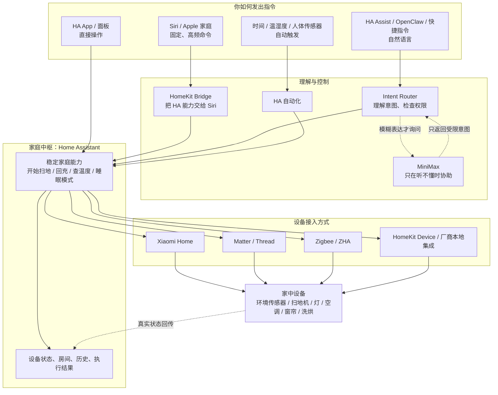

# hudk-home

`hudk-home` 是家庭智能中枢的长期配置与设计仓库。Home Assistant（HA）负责设备接入、实时状态和动作执行；本仓库负责可审查、可测试、可迁移的“期望配置”：能力命名、自动化、语音句式、AI 意图契约、安全策略和运维手册。

## 部署基线

- 中枢：一台可靠、长期运行的 Home Assistant OS 主机
- Apple 出口：HomeKit Bridge → Apple 家庭 → Siri
- 设备入口：Matter、Zigbee、HomeKit Device 或厂商维护的 HA 集成
- 语义层：`intent-router` 作为独立 HA App 运行，规则优先，MiniMax 可配置兜底

## 一张图看懂



读图只需记住三件事：**HA 是唯一中枢**；Siri 固定命令走 HomeKit 快速通道；复杂说法才经过独立意图层，MiniMax 没有直接操作设备的权限。

## 最终架构原则

1. **HA 是唯一执行中枢**：设备状态与命令最终都进入 HA，不让 Siri、OpenClaw 或 AI 直接操作厂商接口。
2. **能力与设备解耦**：上层调用 `vacuum.dock`，而不是记住某个厂商实体 ID；同类设备实例可从 HA 安全暴露范围自动发现。
3. **规则优先，AI 兜底**：确定性命令本地匹配；只有模糊表达才请求 MiniMax。
4. **AI 无任意执行权**：模型只能返回受限意图 JSON，经契约校验、策略检查后映射到 HA 自动发现能力或白名单稳定脚本。
5. **运行状态不进 Git**：凭证、OAuth、设备注册表、历史数据库、HomeKit 配对和备份都留在 HA。
6. **配置与运行状态双轨备份**：Git 保存可读配置；HA 完整备份保存不可重建设备状态。

## 文档导航

- [总体架构](docs/architecture.md)
- [职责与数据边界](docs/responsibilities.md)
- [新设备接入规范](docs/device-onboarding.md)
- [语音与操作控制](docs/voice-and-control.md)
- [业务场景设计](docs/business-scenarios.md)
- [部署与 HA 配置](docs/deployment.md)
- [运维、备份与迁移](docs/operations.md)
- [迁移到独立主机或树莓派](docs/migration-to-dedicated-ha.md)
- [安全设计](docs/security.md)
- [架构决策：HA 运行时能力发现](docs/decisions/0003-ha-runtime-capability-discovery.md)
- [实施路线图](docs/roadmap.md)
- [当前设备清单](docs/device-inventory.md)
- [Intent Router 与 OpenClaw 接入](intent-router/README.md)

## 仓库结构

```text
hudk-home/
├── docs/                       # 架构、接入、场景、运维文档
├── contracts/                  # AI/输入源与执行层之间的稳定契约
├── config/                     # 可提交的示例配置，不含密钥
├── home-assistant/             # HA packages、中文句式和桥接示例
├── intent-router/              # Node.js 意图服务与测试台
├── openclaw-plugin-hudk-home/  # 只暴露统一家庭文本入口的 OpenClaw 工具插件
├── home-assistant-app/         # HA App 清单、配置页和发布说明
├── deploy/                     # 非 HAOS 环境的 systemd 兼容样例
├── .github/workflows/          # 自动测试、类型检查与构建
├── tests/                      # 验收用例与语句样例
├── .env.example
└── .gitignore
```

## 开始使用

1. 先阅读 [新设备接入规范](docs/device-onboarding.md)，不要直接把所有实体暴露给 Apple 或 AI。
2. 在 HA 中为设备分配区域、友好名称和别名；用 `intent_router` 标签控制通用意图层，用 Assist 公开设置单独控制语音。
3. 已有类型模板的设备由 Router 自动发现；特殊或高风险动作封装为 HA 脚本，再登记到 `config/capabilities.yaml`。
4. 对照 [部署说明](docs/deployment.md) 将 packages 和自定义句式同步到 HA。
5. 用 `tests/utterances.yaml` 回归常用表达，再暴露给 Siri 或其他输入源。

Intent Router 的本地开发、HA App 部署、调试开关和 API 示例见 [Intent Router README](intent-router/README.md)。每次修改 Router、契约或能力配置后运行 `pnpm test`、`pnpm typecheck` 与 `pnpm build`；GitHub Actions 会执行同一组检查并发布多架构 App 镜像。

## 仓库不保存什么

不要提交 `.env`、`secrets.yaml`、HA 的 `.storage/`、数据库、日志、完整备份、证书、MiniMax API Key、小米 OAuth、HA 长期访问令牌或 OpenClaw Token。详见 [安全设计](docs/security.md)。

## 参考资料

- [Home Assistant HomeKit Bridge](https://www.home-assistant.io/integrations/homekit/)
- [Home Assistant Assist](https://www.home-assistant.io/voice_control/)
- [Home Assistant Conversation API](https://developers.home-assistant.io/docs/intent_conversation_api/)
- [Home Assistant REST API](https://developers.home-assistant.io/docs/api/rest/)
- [Home Assistant WebSocket API](https://developers.home-assistant.io/docs/api/websocket/)
- [Home Assistant Matter](https://www.home-assistant.io/integrations/matter/)
- [小米官方 Xiaomi Home 集成](https://github.com/XiaoMi/ha_xiaomi_home)
- [MiniMax OpenAI Compatible API](https://platform.minimax.io/docs/api-reference/models/openai/list-models)
