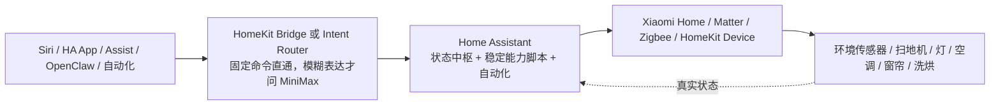
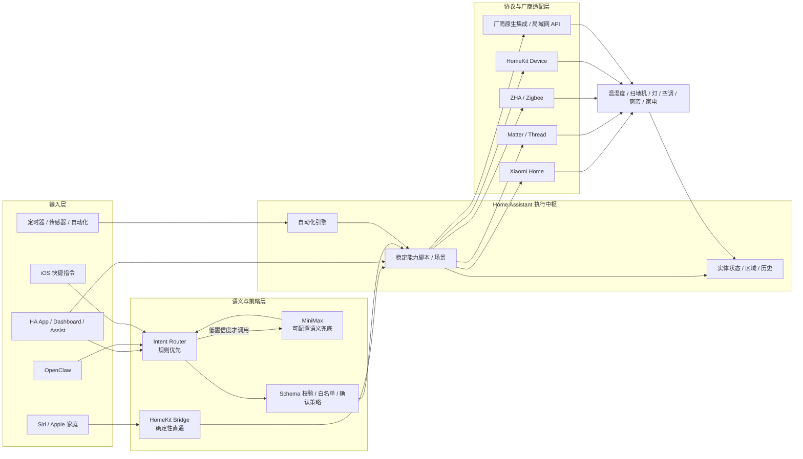

# 总体架构

## 目标

构建一个不依赖单一品牌、可逐步迁移、可让多种输入源控制，但执行边界清晰的家庭自动化平台。系统不要求所有设备都支持 Matter；优先使用设备能力最完整、最稳定的 HA 集成，再由 HA 统一向上提供能力。

## 一图看懂



核心边界：输入源不直接碰设备；AI 不直接碰 HA service；所有动作先映射到 HA 的稳定能力。

## 详细逻辑架构



## 两条控制链路

### 1. 快速、确定性链路

```text
“嘿 Siri，开始扫地”
→ Apple 家庭
→ HomeKit Bridge 暴露的“开始扫地”脚本
→ HA script.hudk_vacuum_start
→ vacuum.start
→ Xiaomi Home
→ 扫地机器人
```

优点是响应快、组件少、AI 故障不影响基本控制。缺点是 Siri 原生 HomeKit 更依赖名称和别名，不会自动经过自建 AI。

### 2. 自然语言链路

```text
OpenClaw / HA Assist / iOS 快捷指令输入一句话
→ Intent Router HA 目录别名与本地规则
→ 必要时调用 MiniMax 做意图识别
→ 标准意图 JSON
→ Schema + 安全策略 + 目标白名单
→ HA 运行时能力映射或稳定能力脚本
→ 设备集成
→ 返回执行结果
```

这条链路解决“让扫地机回家吧”“地上有点脏，收拾一下”等表达差异。OpenClaw 只是输入源，MiniMax 只是可替换的语义提供方，HA 仍是执行者。

## 物理部署

### 推荐部署

- HAOS 运行在可靠、长期在线的独立主机或虚拟机中。
- 路由器为 HA 设置 DHCP 保留地址，但真实地址不写入仓库。
- 意图服务作为 HA App 运行在 HAOS 内，与 HA Core 保持独立容器边界。
- Apple 家庭、手机和 HA 位于同一可信局域网。

### 未来迁移

HAOS 可迁往树莓派 + SSD、Home Assistant Green 或低功耗主机。恢复包含 Apps 的 HA 完整备份后，Router 配置随 HA 迁移；能力契约、语音句式保持不变，外部 OpenClaw 只需改为新 HA 主机地址。

## 不采用的设计

- 不让 OpenClaw 成为中枢：它只是输入源，停机不应影响自动化。
- 不让 LLM 直接调用任意 HA service：无法限制幻觉和错误实体。
- 不强行把全部设备转成 Matter：原生集成往往暴露更多厂商能力。
- 不把 HA `.storage` 当普通源码同步：包含运行状态和敏感信息，且不适合人工合并。
