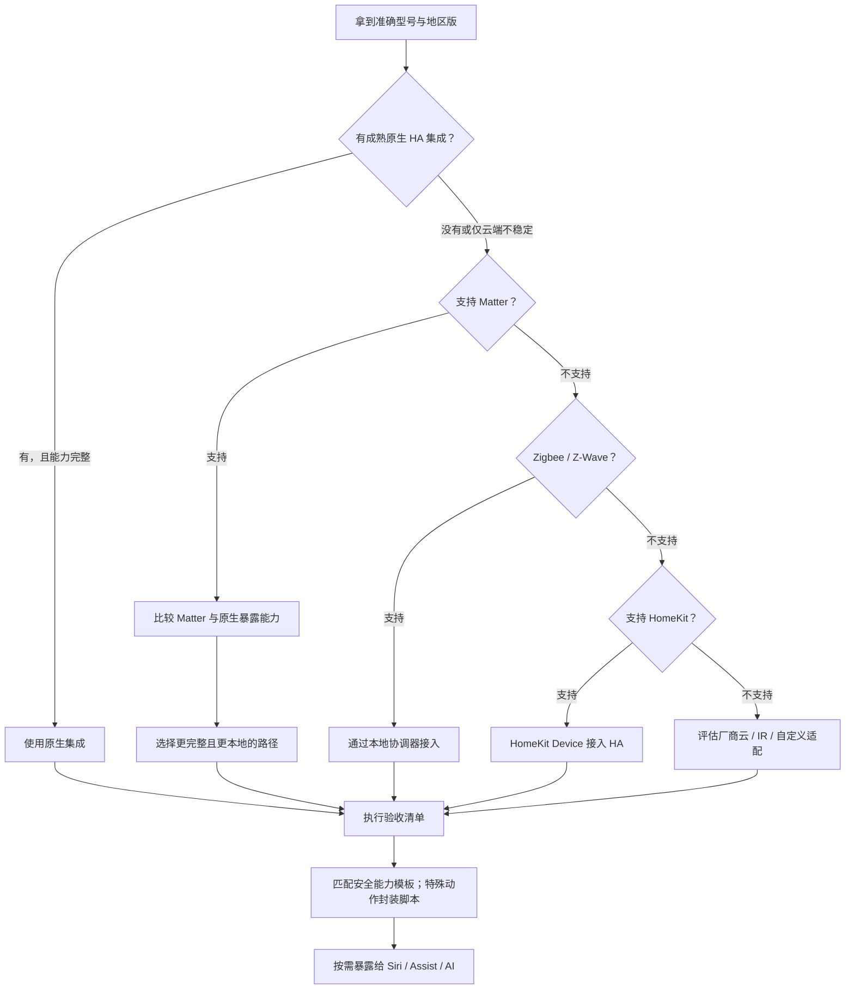

# 新设备接入规范

## 目标

任何新设备都先进入 HA，完成状态、控制、离线行为和安全验收后，再选择性暴露给 Apple 家庭、Assist、自动化和 AI。不要因为包装上写有 Matter 就默认它是最佳接入方式。

## 购买前检查

按以下优先顺序判断：

1. **HA 官方/厂商维护的原生集成**：通常功能最完整；优先选择本地通信。
2. **Matter over Wi-Fi/Thread**：跨品牌、局域网优先，但可能只提供通用基础能力。
3. **Zigbee + ZHA**：传感器、开关、灯具适合；需要协调器，注意兼容性与信道干扰。
4. **HomeKit Device**：HomeKit 设备可直接配对到 HA，本地性通常较好。
5. **厂商云集成**：没有本地方案时使用，并明确断网降级行为。
6. **红外/RF 网关或自定义协议**：作为最后适配层，状态可能无法可靠回读。

查询型号时要找：明确型号、地区版、通信协议、是否依赖网关、HA 集成页面、实际可用实体。品牌相同不代表协议相同。

## 接入决策树



## 标准接入步骤

### 1. 建档

在 `docs/device-inventory.md` 记录：

- 品牌、型号、固件、所在房间
- 接入协议与 HA 集成
- 云端依赖和局域网依赖
- 设备实体 ID、关键属性和可执行动作
- 断网、断电、重启后的行为

### 2. 在 HA 接入

- Matter：HAOS 安装 Matter Server，并通过 HA Companion App 配网或从 Apple Fabric 共享。
- Xiaomi：使用小米官方 `Xiaomi Home` 集成，同步正确国家/地区和家庭。
- Zigbee：接入协调器后使用 ZHA；同一 Zigbee 网络只有一个协调器。
- HomeKit：未绑定或已重置的设备通过 `HomeKit Device` 配对进 HA。
- 其他厂商：优先 HA 官方集成，其次是维护活跃、来源可信的自定义集成。

### 3. 标准化

- 分配区域：客厅、卧室、厨房等。
- 如果多个实体属于同一设备，优先给设备分配区域；Router 会在实体没有独立区域时继承设备区域名称和别名。
- 友好名称避免品牌噪声，例如“客厅扫地机”。
- 为常用口语增加别名，例如“扫地机器人”“小扫地机”。
- 禁用无用、重复或敏感实体，避免 HomeKit/Assist 列表污染。
- 不改变已经用于自动化的实体 ID；厂商实体变化由能力脚本吸收。

### 4. 验收

- 状态更新：设备变化能否及时反映在 HA。
- 基础控制：开始、停止、回充等每个动作单独验证。
- 网络异常：断互联网、重启 HA、设备离线时反馈是否明确。
- 幂等性：重复执行是否安全，例如已经回充时再次回充。
- 权限：是否真的需要暴露给 Siri、Assist、OpenClaw 或 AI。
- 回滚：删除集成前是否有 HA 完整备份。

### 5. 能力封装与发布

只读信息和控制动作采用不同规则：

- 对 `sensor`、`binary_sensor`、`event` 等安全只读实体，设置清晰名称并添加 `intent_router` 标签即可。专用模板优先；没有模板时 Router 会自动生成 `entity.read`，无需按品牌或字段改代码。
- 对灯、扫地机、空调、门锁、按钮等会改变设备状态的能力，只有通过验收的动作才允许进入 Router。控制动作必须命中受审查模板，或先封装为稳定 HA 脚本。

是否公开给 Assist 单独决定。对于厂商特殊动作、高风险动作或需要稳定兼容层的能力，仍先封装 HA 脚本，再给稳定脚本加标签或登记静态能力。例如：

```text
vacuum.start → script.hudk_vacuum_start
vacuum.dock  → script.hudk_vacuum_dock
climate.read → 只读传感器查询
```

之后根据需要：

- HomeKit Bridge：只暴露需要 Siri/Apple 家庭控制的实体与脚本。
- HA Assist：暴露实体，维护别名或自定义句式。
- Intent Router：只加入白名单能力，不加入原始设备 service。

### 自动发现验收

1. 在 HA 的实体设置中给允许进入 Router 的具体实体添加 `intent_router` 标签。
2. 在 Router 测试台点击“同步 HA”，确认状态为 `ok`。
3. 检查脱敏目录中出现的是逻辑目标，没有 HA `entity_id`。
4. 用设备友好名称和房间名称各发一句调试请求，确认命中了预期模板与目标。
5. 未命中模板的安全只读实体应出现为 `entity.read`；未命中模板的可写设备不会自动获得控制能力，必须先补充风险、来源、动作、成功条件和失败响应。不要让 AI 动态决定 service。
6. 需要 HA Assist 语音控制时，再独立配置 Conversation 公开范围。

新增普通只读实体不修改 Router 或 `config/capabilities.yaml`；新增专用语义、聚合查询或控制动作时才修改版本库。完整说明见 [Intent Router 设计理念](intent-router-design.md)。设备真正投入使用时，仍需同步更新本地设备清单；可提交的类型模板与 `config/capabilities.yaml` 按仓库规则一起审查。

## 协议选择提示

- Matter 是通用应用层标准，不等于所有家电都已支持，也不保证厂商高级功能完整。
- Thread 是网络承载，不是 Matter 的替代；Matter 也可以跑在 Wi-Fi 上。
- HomeKit Bridge 是“HA → Apple”；HomeKit Device 是“设备 → HA”，方向不要混淆。
- Zigbee、蓝牙和红外需要物理无线适配器或网关；协议转换逻辑仍由 HA 集成承担。
